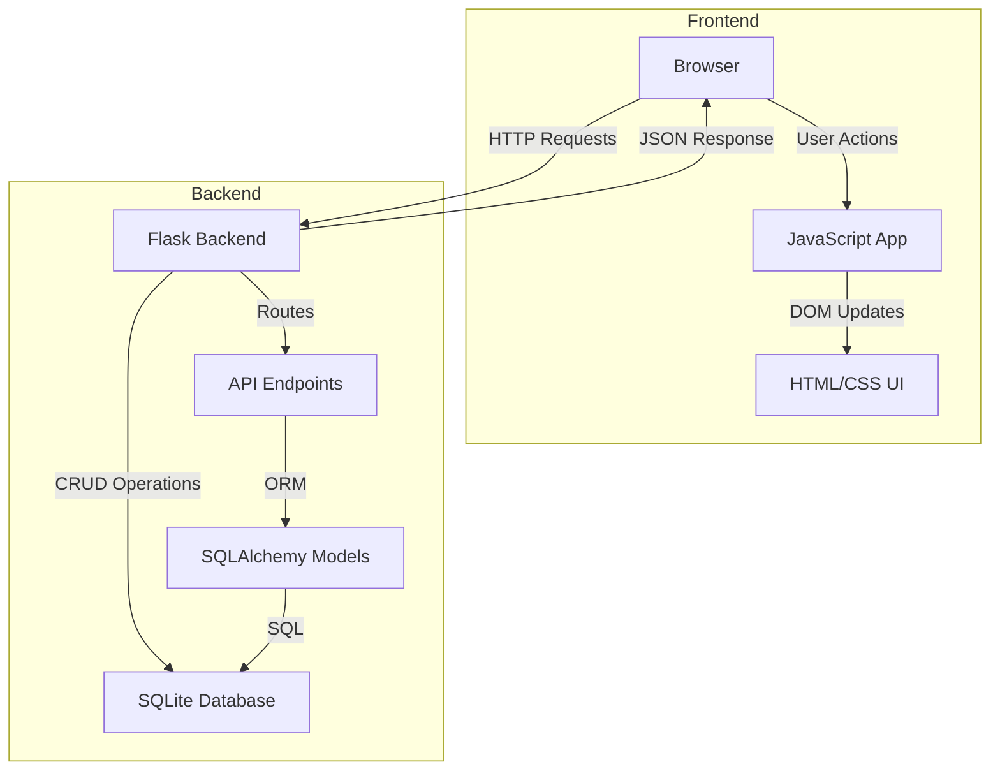
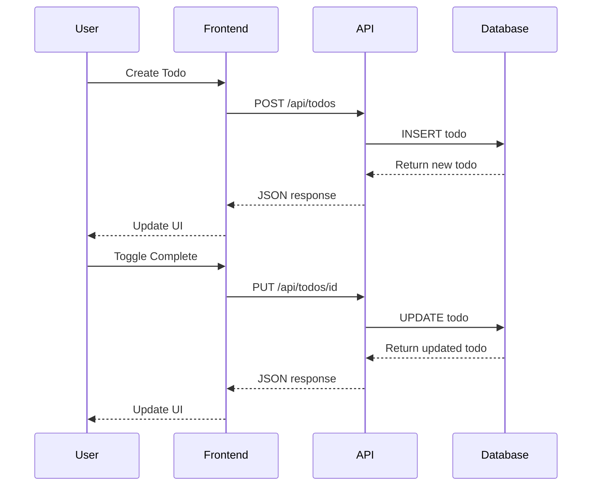

# Todo Application - Technical Plan

## 1. Project Directory Structure

```
todo-app/
├── backend/
│   ├── app.py                 # Main Flask application
│   ├── config.py              # Configuration settings
│   ├── models.py              # Database models
│   ├── routes.py              # API route definitions
│   ├── database.py            # Database initialization
│   ├── requirements.txt       # Python dependencies
│   └── todos.db              # SQLite database (auto-generated)
├── frontend/
│   ├── index.html            # Main HTML page
│   ├── css/
│   │   └── style.css         # Application styles
│   └── js/
│       ├── app.js            # Main application logic
│       └── api.js            # API communication layer
└── docs/
    └── API.md                # API documentation
```

## 2. API Endpoints

### Base URL: `http://localhost:5000/api`

| Method | Endpoint | Description | Request Body | Response |
|--------|----------|-------------|--------------|----------|
| GET | `/todos` | Get all todos | None | `[{id, title, description, completed, created_at}]` |
| GET | `/todos/<id>` | Get single todo | None | `{id, title, description, completed, created_at}` |
| POST | `/todos` | Create new todo | `{title, description?}` | `{id, title, description, completed, created_at}` |
| PUT | `/todos/<id>` | Update todo | `{title?, description?, completed?}` | `{id, title, description, completed, created_at}` |
| DELETE | `/todos/<id>` | Delete todo | None | `{message: "Todo deleted"}` |

### Request/Response Examples

**POST /api/todos**
```json
Request:
{
  "title": "Buy groceries",
  "description": "Milk, eggs, bread"
}

Response (201 Created):
{
  "id": 1,
  "title": "Buy groceries",
  "description": "Milk, eggs, bread",
  "completed": false,
  "created_at": "2026-05-20T10:00:00Z"
}
```

**PUT /api/todos/1**
```json
Request:
{
  "completed": true
}

Response (200 OK):
{
  "id": 1,
  "title": "Buy groceries",
  "description": "Milk, eggs, bread",
  "completed": true,
  "created_at": "2026-05-20T10:00:00Z"
}
```

**Error Response Format**
```json
{
  "error": "Error message description",
  "status": 404
}
```

## 3. Database Schema

### Technology: SQLite (simple, file-based, no setup required)

### Table: `todos`

| Column | Type | Constraints | Description |
|--------|------|-------------|-------------|
| id | INTEGER | PRIMARY KEY, AUTOINCREMENT | Unique identifier |
| title | TEXT | NOT NULL | Todo title (required) |
| description | TEXT | NULL | Optional detailed description |
| completed | BOOLEAN | NOT NULL, DEFAULT 0 | Completion status |
| created_at | TIMESTAMP | NOT NULL, DEFAULT CURRENT_TIMESTAMP | Creation timestamp |

### SQL Schema
```sql
CREATE TABLE todos (
    id INTEGER PRIMARY KEY AUTOINCREMENT,
    title TEXT NOT NULL,
    description TEXT,
    completed BOOLEAN NOT NULL DEFAULT 0,
    created_at TIMESTAMP NOT NULL DEFAULT CURRENT_TIMESTAMP
);
```

## 4. Technology Stack

### Backend
- **Framework**: Flask 3.0+ (lightweight Python web framework)
- **Database**: SQLite3 (built-in, no installation needed)
- **ORM**: Flask-SQLAlchemy (database abstraction)
- **CORS**: Flask-CORS (enable cross-origin requests)
- **Validation**: Built-in Python validation

### Frontend
- **HTML5**: Semantic markup
- **CSS3**: Modern styling with Flexbox/Grid
- **Vanilla JavaScript**: No framework dependencies (ES6+)
- **Fetch API**: For HTTP requests

### Development Tools
- **Python**: 3.8+
- **pip**: Package management
- **Virtual Environment**: venv (Python isolation)

### Dependencies (requirements.txt)
```
Flask==3.0.0
Flask-SQLAlchemy==3.1.1
Flask-CORS==4.0.0
```

## 5. Implementation Plan

### Phase 1: Backend Setup
1. Create project structure
2. Set up Python virtual environment
3. Install dependencies
4. Configure Flask application
5. Create database models
6. Implement API routes
7. Add error handling and validation
8. Test API endpoints

### Phase 2: Frontend Development
1. Create HTML structure
2. Design CSS styling
3. Implement API communication layer
4. Build todo list UI
5. Add create/update/delete functionality
6. Implement completion toggle
7. Add user feedback (loading states, errors)

### Phase 3: Integration & Testing
1. Connect frontend to backend
2. Test all CRUD operations
3. Handle edge cases
4. Add input validation
5. Improve UX with animations

## 6. Key Features

### Backend Features
- RESTful API design
- JSON request/response format
- Input validation
- Error handling with appropriate HTTP status codes
- CORS enabled for frontend access
- SQLite database with automatic initialization

### Frontend Features
- Clean, responsive UI
- Add new todos with title and description
- Mark todos as complete/incomplete
- Edit existing todos
- Delete todos
- Real-time updates
- Error handling and user feedback
- Loading states during API calls

## 7. Architecture Diagram



## 8. Data Flow



## 9. File-by-File Implementation Guide

### Backend Files

**backend/app.py** (Main application entry point)
- Initialize Flask app
- Configure CORS
- Register routes
- Run development server

**backend/config.py** (Configuration)
- Database URI
- Debug settings
- CORS settings

**backend/models.py** (Database models)
- Todo model with SQLAlchemy
- Model methods (to_dict, etc.)

**backend/database.py** (Database setup)
- Database initialization
- Create tables function

**backend/routes.py** (API routes)
- GET /api/todos (list all)
- GET /api/todos/<id> (get one)
- POST /api/todos (create)
- PUT /api/todos/<id> (update)
- DELETE /api/todos/<id> (delete)

**backend/requirements.txt** (Dependencies)
- Flask and extensions

### Frontend Files

**frontend/index.html** (UI structure)
- Todo list container
- Add todo form
- Todo item template

**frontend/css/style.css** (Styling)
- Layout and responsive design
- Todo item styles
- Form styles
- Animations

**frontend/js/api.js** (API layer)
- Fetch wrapper functions
- Error handling
- Base URL configuration

**frontend/js/app.js** (Application logic)
- DOM manipulation
- Event handlers
- State management
- UI updates

## 10. Running the Application

### Backend
```bash
cd backend
python -m venv venv
source venv/bin/activate  # On Windows: venv\Scripts\activate
pip install -r requirements.txt
python app.py
```
Server runs on: `http://localhost:5000`

### Frontend
Simply open `frontend/index.html` in a web browser, or use a simple HTTP server:
```bash
cd frontend
python -m http.server 8000
```
Frontend runs on: `http://localhost:8000`

## 11. Next Steps

After reviewing this plan:
1. Confirm the structure meets your needs
2. Switch to Code mode to implement the application
3. Follow the implementation plan phase by phase
4. Test each component as it's built